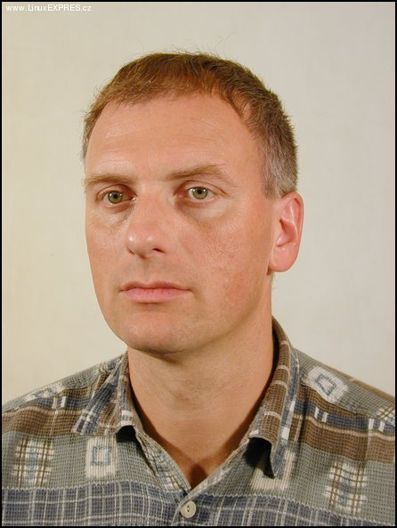

# cdrecord的故事汇
`Thursday, 26 April 2007`



在这个晚春的早上, 写一写cdrecord的故事, 也许对大家有些警示.

cdrecord, 主要用于刻盘, 刻CD, DVD.

这个软件有很长的历史, 作者是Jorg Schilling.

开始, 作者把cdrecord的CD刻录部分开源, 在GPL协议之下, 但DVD刻录的源码不
在GPL下而是可以用于个人目的, 全免费. 但商业目的不行. 不久一些GPL的小战
士就看出了矛盾, 因为DVD刻录部分和CD部分不可分. CD在GPL下按GPL, DVD也应
该.

但Jorg这个傻子, 愣不承认这个逻辑:)

他人在德国, 还不承认美国的法律, 而且他所谓商业的应用应付费, 根本不提供
任何的付费渠道写信问他他也没有, 他的电话也保密的紧, 别人给他钱他骂别人,
他说我不是奴隶, 你给我钱我就做工,用户有问题问他他骂别人傻瓜. 骂骂咧咧.

```
用户, 其他的程序员, 商业公司也离不开他这个东西
后来商业公司不管那么多了
直接在CDrecord上加个界面, 出来卖钱
也没见这个傻蛋告谁
大部分的商业刻录软件都基于cdrecord的源码
他也不查
继续在那骂人
GPL的年轻斗士们
觉得Jorge的行为侮辱了GPL
faint的不得了
跳着高的跟Jorg对骂
Jorg也跟着骂
不管不顾的
说妈的我这辈子也不去美国
你Y美国法律管不了我
我只服德国和欧盟的法律
就这么个人
混球似的

但那些自由软件的老人们
却深深理解Jorg的心 :-)

很早cdrecord就进了debian的release
进debian的发行版很不易的
比如mplayer到现在也没进去
每年申请人都不批准
不管你多好你代码不干净我就不要

GPL的小孩们要把Jorge开除出自由软件门
老人们就不干了
说小孩滚蛋
人Jorg刻光盘的时候, 你们这帮小孩还是液体呢

后来把Jorg灌醉了
德国人也挺好酒的
变了另一个项目, 好说歹说
说了些好话
http://www.cdrkit.org/
变 成了cdrkit. 
管项目的挺靠谱的. 
比Jorg平和多了. 
那样还少得罪些人. 
现在的linux用户牛多了. 
用你的程序就跟多给作者脸似的. 
也不管作者是否挨饿. 
cdrkit是debian的那些老人开的. 
这两年的事. 
算cdrecord的一个正统.
```

cdrkit, like the programs from which it was derived, is distributed as
free software under the terms of the GNU GPL version 2. (Note, this is
not "version 2 or later" as you see in many software projects.) 括号里
的很像Jorg的做派. 那么的较真儿. 孩子似的.

对bug的态度:
```
Cdrecord has even more options than ls.

There should be a recover option to make disks usable, that have been
written during a power failure.
```

文档写的象狗屎, 语法都不通有时候, 跟其他人也不怎么玩, 就在那傻坐着. 基
本不懂法律. 还想让法律保护自己.

最近两天在cygwin下用了cdrecord, 根本也没有毛病, 很好用

- 呵呵，疯子就是牛
```
cdrecord -vv -dev=cd isoname
他不疯
在德国挺正常的
因为德国
基本就是地球的疯人院
地球的大脑
地球的大脑都在德国
- 我现在电脑的内存也是1.5G了。呵呵
足够了
空着也没啥用
我经常空着
- 我现在在自己机器上倒几百m的东西没啥问题：）
一般如果我发现我机器用了多于1G的内存
我就要想想我是不是没用脑子做事
因为我发现很多猪头电脑都用的挺恨的, 跑着无意义的程序;

很多cdrecord的变种, 一运行就说:
这是cdrecord的变种, 如果出错的话, 别去烦原作者,找我好了
Jorg就喜欢这样的
```

另一件事,
也反应出对bug的态度

The cause for the compilation problems is a bug in the Linux kernel
include files. It is a bad idea to try to "fix" correct code instead
of fixing the bugs.

After 2 years, the bug in the Linux kernel has been fixed in
2.6.8. Unfortunately Linux-2.6.8.1 started to break CD/DVD writing in
suid root applications by breaking interfaces :-(

前因是在2.6.8.1上没法编译

于是一个就做了个patch

这样就可以编译过了.

但Jorg不同意这么做. 谁的bug谁fix. kernel怎么着? 中央有错也得改.

```
/*
* You are not allowed to modify or remove the following code.
* I am sorry that I am forced to do things like this, but defective
* versions of cdrecord cause a lot of work load to me and it seems
* to be impossible to otherwise convince SuSE to cooperate.
* As people contact me and bother me with the related problems,
* it is obvious that SuSE is violating subsection 6 in the preamble of
* the GPL.
*
* Note that although the SuSE test is effective only for SuSE, the
* intention to have non bastardized versions out is not limited
* to SuSE. It is bad to see that in special in the "Linux" business,
* companies prefer a model with many proprietary differing programs
* instead of cooperating with the program authors.
*/
```

这一段. 孩子似的, 乱写乱画. 感想都写进代码里. 当日记用. 其实找律师比较
靠谱, 还能得到钱.

Jorg的粉丝可都是死硬派, 一个顶一个

I'll give you a fucking break alright, you prick.

Quoting you: "Jorg Schilling has not provided a very good program
based on the lack of help you can find for it on the internet. You
should do a better job."

My point was that your criticism of Jorg went too far. "You should do
a better job"? Give ME a fucking break. You lost all hope of getting
any help, especially from me you dickhead. . 这个shock56, 抢着要当Jorg
的粉丝, 但另一个粉丝TheKepper说, 瞧你那德行, 你丫不配之后shock56说了,
我俩的事你别瞎掺和. 人Jorg都同意我当粉丝了, 你干嘛拦着? TheKeeper说,
人Jorg太善了, 我就看不了你这鸡贼乱欺侮. 他俩对骂了许久. 那大约是2003年
间的事.

