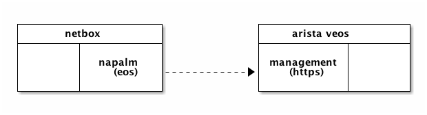
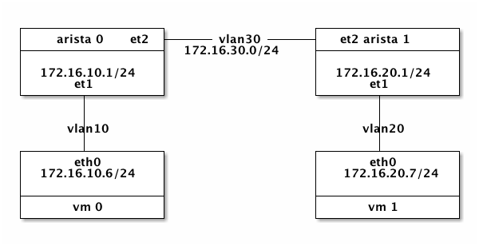

`<2017-12-06 Wed>`

How to run arista vEOS in OpenStack.

## vEOS Image

### Download

Download below files:

1. `Aboot-veos-8.0.0.iso`,
2. `vEOS-lab-4.20.1F.vmdk`

from: [[https://www.arista.com/en/support/software-download]]

### Upload

Upload to OpenStack Glance:

```
openstack image create Aboot-veos-8.0.0.iso \
          --container-format bare \
          --disk-format iso \
          --file Aboot-veos-8.0.0.iso
openstack image create vEOS-lab-4.20.1F.vmdk \
          --container-format bare \
          --disk-format vmdk \
          --file vEOS-lab-4.20.1F.vmdk
```

### List images

```
openstack image list
#=>
| name                  | id                                   | type       |
|-----------------------|--------------------------------------|------------|
| Aboot-veos-8.0.0.iso  | 43c78dee-e055-4592-9b81-d66f6a33584d | iso image  |
| vEOS-lab-4.20.1F.vmdk | ba02703d-6d2b-40a8-bdb7-bf41163d78f7 | vmdk image |
```

## Boot vEOS VM

### Prerequisite

Before boot VM, make sure:
1. OpenStack volume service - cinder is running,
2. Disable OpenStack security groups,
3. Disable ebtables on hypervisor

A workaround to disable ebtables:

```
ansible -m cron -a 'job="/sbin/ebtables -F" name="flush ebtables"' all
```

### Boot VM

```
nova boot --flavor m1.medium \
    --image Aboot-veos-8.0.0.iso \
    --nic net-id=64304c68-646f-4a2b-8a7a-e8f557c4b94a \
    --nic net-id=15bfca37-119e-475e-ad0e-fc2e377cac32 \
    --nic net-id=7c072643-2170-4a46-9dc2-e04f5f427f72 \
    --block-device \
    id=ba02703d-6d2b-40a8-bdb7-bf41163d78f7,\
	source=image,bus=ide,dest=volume,size=4,shutdown=remove \
    veosvm1
```

### Notices

1. The first network is for vEOS management port, the left are for
   vEOS switch ports,
2. The id(ba02703d-6d2b-40a8-bdb7-bf41163d78f7) in block device
   option is the image id of glance image vEOS-lab-4.20.1F.vmdk,
3. Make sure bus is set to ide

## Enable SSH

Get vm's novnc console:

```
nova get-vnc-console veosvm1 novnc
```

Go to the novnc console to configure network:

```
login: admin # default username admin, no password
> enable
# configure terminal
# interface management 1
# ip address 192.168.0.15 255.255.0.0
# ip route 0.0.0.0 0.0.0.0 192.168.0.1
# hostname veosvm1
# username admin secret 0 admin
# end
# copy running-config startup-config
```

Now you can use ssh `ssh admin@192.168.0.15` to login.

## Netbox Integration

### Enable Management Api

```
ssh admin@192.168.0.15 # password admin
> enable
# config terminal
# management api http-commands
# no shutdown
# no protocol http
# protocol https
# end
# show management api http-commands #=>
Enabled:            Yes
HTTPS server:       running, set to use port 443
HTTP server:        shutdown, set to use port 80
Local HTTP server:  shutdown, no authentication, set to use port 8080
Unix Socket server: shutdown, no authentication
VRFs:               default
Hits:               75
Last hit:           36 seconds ago
Bytes in:           11714
Bytes out:          178064
Requests:           60
Commands:           147
Duration:           5.294 seconds
SSL Profile:        none
FIPS Mode:          No
QoS DSCP:           0
Log Level:          none
CSP Frame Ancestor: None
TLS Protocols:      1.0 1.1 1.2
   User        Requests       Bytes in       Bytes out    Last hit
----------- -------------- -------------- --------------- --------------
   admin       60             11714          178064       36 seconds ago

URLs
--------------------------------------
Management1 : https://192.168.0.15:443
# copy running-config startup-config
```

### Napalm

So that netbox can talk to vEOS via napalm:

```
  +--------------------+             +---------------------+
  |      netbox        |             |   arista veos       |
  +--------+-----------+             +------------+--------+
  |        |           |             |            |        |
  |        |  napalm   |             | management |        |
  |        |   (eos)   +-----=------>|   (https)  |        |
  |        |           |             |            |        |
  +--------+-----------+             +------------+--------+
```



## A Clasic Configuration

### Topology

```
     +-----------------+                  +-----------------+
     |   arista 0  et2 +------vlan30------+ et2 arista 1    |
     +-----------------+ 172.16.30.0/24   +-----------------+
     |                 |                  |                 |
     | 172.16.10.1/24  |                  | 172.16.20.1/24  |
     |      et1        |                  |      et1        |
     +-------+---------+                  +-------+---------+
             |                                    |
             |                                    |
           vlan10                               vlan20
             |                                    |
     +-------+---------+                  +-------+---------+
     |      eth0       |                  |      eth0       |
     | 172.16.10.6/24  |                  |  172.16.20.7/24 |
     |                 |                  |                 |
     +-----------------+                  +-----------------+
     |      vm 0       |                  |      vm 1       |
     +-----------------+                  +-----------------+
```


### Create Topology

```yaml
  ---
  - name: "Create network vlan10, vlan20, vlan30"
    hosts: localhost
    tasks:
      - name: "ensure networks created."
        os_network:
           name: "{{ item }}"
           state: present
        with_items:
          - vlan10
          - vlan20
          - vlan30
      - name: "ensure vlan subnets created"
        os_subnet:
          name: "vlan{{ item }}-subnet"
          state: "present"
          network_name: "vlan{{ item }}"
          cidr: "172.16.{{ item }}.0/24"
          enable_dhcp: True
        with_items:
          - "10"
          - "20"
          - "30"
  - name: "Create arista vms"
    hosts: localhost
    tasks:
     - name: "ensure arista-0 created"
       shell: |
         nova show arista-0 &> /dev/null && exit 0
         nova boot --flavor m1.small \
           --image Aboot-veos-8.0.0.iso \
           --nic net-name=netops \
           --nic net-name=vlan10,v4-fixed-ip=172.16.10.1 \
           --nic net-name=vlan30,v4-fixed-ip=172.16.30.3 \
           --block-device \
           id=ba02703d-6d2b-40a8-bdb7-bf41163d78f7,\
		   source=image,bus=ide,dest=volume,size=4,shutdown=remove \
           arista-0
     - name: "ensure arista-1 created"
       shell: |
         nova show arista-1 &> /dev/null && exit 0
         nova boot --flavor m1.small \
           --image Aboot-veos-8.0.0.iso \
           --nic net-name=netops \
           --nic net-name=vlan20,v4-fixed-ip=172.16.20.1 \
           --nic net-name=vlan30,v4-fixed-ip=172.16.30.4 \
           --block-device \
           id=ba02703d-6d2b-40a8-bdb7-bf41163d78f7,\
		   source=image,bus=ide,dest=volume,size=4,shutdown=remove \
           arista-1
  - name: "Create vm"
    hosts: localhost
    roles:
      - role: vm
        group: vlan10vm
        network: vlan10
  - name: "Create vm"
    hosts: localhost
    roles:
      - role: vm
        group: vlan20vm
        network: vlan20
```

### Configure Arista 0
```
enable
config terminal

interface management 1
ip address 192.168.0.14.16

vlan 10
vlan 30

interface ethernet 1
switchport mode access
switchport access vlan 10
no shutdown

interface ethernet 2
switchport mode trunk
switchport trunk allowed vlan 30
no shutdown

interface vlan10
ip address 172.16.10.1/24

interface vlan30
ip address 172.16.30.3/24

ip routing
router ospf 10
network 172.16.10.0/24 area 0
network 172.16.30.0/24 area 0

end
```

### Configure Arista 1

```bash
interface management 1
ip address 192.168.0.26/16
no shutdown

vlan 20
vlan 30

interface ethernet 1
switchport mode access
switchport access vlan 20
no shutdown

interface ethernet 2
switchport mode trunk
switchport trunk allowed vlan 30
no shutdown

interface vlan 20
ip address 172.16.20.1/24
no shutdown

interface vlan 30
ip address 172.16.30.4/24
no shutdown

ip routing
router ospf 10
network 172.16.20.0/24 area 0
network 172.16.30.0/24 area 0

end
```

### Test
login vm-0 and ping vm-1.

## Tips

1. [vEOS does not support NAT](https://eos.arista.com/forum/qeustions-about-some-features-in-veos-that-may-or-may-not-work/)

