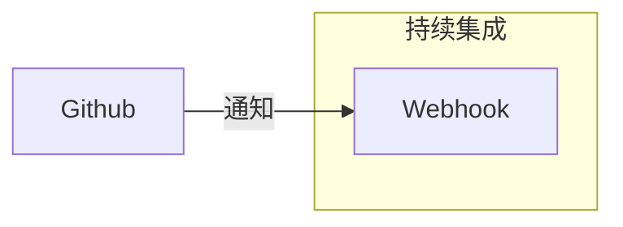
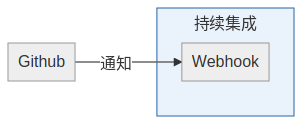
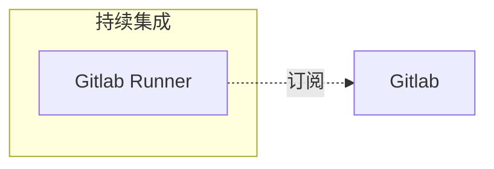
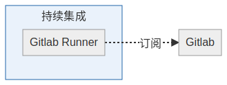

# Gitlab的持续集成

`<2019-12-07 六>`

Gitlab持续集成采用订阅模式，这和Github的通知机制不同。

## Github通知机制
   
Github的持续集成采用通知机制。

如下图所示：

持续集成的开发人员需要实现一个Webhook来接收Github的消息通知。这个
Webhook是一个服务，需要保证安全，保证可调用。

Gitlab不是这么做的。

## Gitlab订阅模式

Gitlab用订阅的模式来做持续集成。如下图示：

这样 `gitlab runner` 可以是跑在内网的某台机器，只要该机器通过`http`协
议能访问gitlab就可以。这种方式对持续集成的开发人员成本较低。但对Gitlab
服务方，成本较高。Gitlab能支持多少个Runner挂在上面呢？

## Gitlab Runner如何工作
   
`Gitlab Runner` 每3秒访问一下Gitlab看有没有任务，如有任务，扯下来执行。
如无任务，3秒后见。

`Gitlab Runner` 后面可以跑docker， kubernetes等。我觉得通过 `Gitlab
Runner` 的shell模式可以跑`lxd` 。
