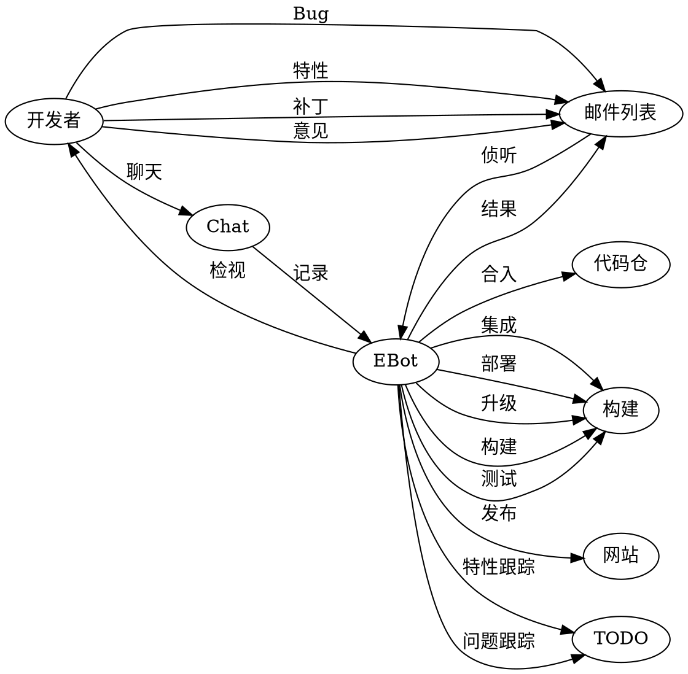
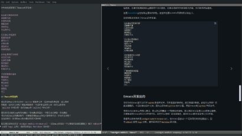

<div style="text-align: right"><code>2021年12月25日 星期六 上午 阴</code></div>

最近[Emacs开发]少有热闹，大家在讨论迁移[Emacs]开发到[sourcehut]的事。

## [Sourcehut]

[Sourcehut]是一个开源工具集搭建软件开发平台，提供如下能力：

1. [Git]和[Mercurial]代码仓托管，
2. 强大持续集成，
3. 基于邮件列表和[Git Send Mail]的代码检视与合并，
5. 基于邮件的任务（和缺陷）管理，
6. 久经考验的账户管理与安全，
7. Markdown和Git驱动的Wiki，
8. [代码分享](https://paste.sr.ht)，[静态页面托管](https://srht.site)，
   以及与[第三方服务集成](https://dispatch.sr.ht)

几乎每一条都对我特有吸引力！而且竟然是[Drew DeVault]一人所为！

我拿我的华为[花瓣邮箱]注册一个账号，却迟迟收不到确认信。我有些怀疑[花
瓣邮箱]存在问题。

## [花瓣邮箱]

[花瓣邮箱]是华为手机升级鸿蒙后推出的一个应用。当时我刚好没有合适的主力
邮箱可用，就欣然接受，打算有时间把邮箱用起来。

### 国内邮箱

除了[花瓣邮箱]，我还有三个邮箱：
1. [Gmail]，
2. [QQ Mail]，
3. [139邮箱]。

### Gmail的使用

我之前主力邮箱是[Gmail]。[Gmail]在没有合适代理的情况下在国内很难直接使
用。我把[Gmail]邮箱配置在[QQ Mail]的手机客户端里，[QQ Mail]帮我翻墙出
去，我勉强可以收发信。可谓细若游丝，命悬一线地在用。使用场景也剩下唯一
的一个：发电子书到Kindle邮箱。亚马逊有个服务听在那，把附件转化后推到我
的Kindle上。

因此在国内[Gmail]作为主力邮箱是不合适的。

### 深入花瓣

如今仔细看[花瓣邮箱]，发现其目前只支持手机客户端和Web客户端收发信，不
支持任何一种协议包括POP3，IMAP以及SMTP协议。[花瓣邮箱]也没有帮助文档，
当你需要帮助的时候，“智能助手”跳出来回答你的问题，是问答式的，经常所
答非所问。勉强从一个问题回答的侧面推断出[花瓣邮箱]暂不支持第三方客户端，
也就是不支持POP3, IMAP以及SMTP协议。另外我迟迟收不到确认信。基本打消了
我把[花瓣邮箱]作为我的主力邮箱，配置在Emacs里使用的x想法。

### QQ邮箱

[QQ Mail]倒是支持主流协议，但需要打开一下。在打开IMAP和SMTP协议支持的
候，[QQ Mail]提示下载QQ，做一些安全方面的校验。但我在Linux下到哪里去下
载QQ呢？链接指向了一个Windows QQ下载。难道是要我用[Wine]将其灌醉，然后
加载运行吗？这种无脑设计让人不知道说什么。最终放弃扶正QQ邮箱的打算。

### 139邮箱

[139邮箱]提的口号是手机号就是邮箱。但手机号当邮箱使用又有手机暴露的风
险。这也是我一直没有怎么正经用的原因。如今回头重新看139信箱，发现它提
供了邮箱别名的功能。选名的过程中发现[139邮箱]帮助文档非常详实，各种协
议支持完备。打开协议支持也需要一些安全方面的验证，但是使用的是手机验证。
那这就方便多了。

在[Emacs]配好[139邮箱]后给[Drew DeVault]发信，问他确认信没收到的事。他
很快回信，告诉我花瓣可能哪里配置的不对，他发到我花瓣的信被退回来了。这
证实了我的猜测。

### 正告花瓣

这里正告[花瓣邮箱]:

1. 老老实实把基本功能做好
   
   邮箱一定要能收发信，收不到信的邮箱叫什么鬼邮箱？！
2. 老老实实去支持基本的协议

	支持IMAP和SMTP协议，方便第三方客户端配置，而不要贸然以云之名把这些
    历史沉淀下来的东西扬弃。
3. 老老实实去写帮助文档

   用一个所谓`智能助手`的东西去糊弄是不行的。

### Gnus

于是重回Gnus怀抱。配置信箱，订阅邮件列表，写信，读信。

读Gnus的info文档，拉倒最后，有一首小诗：

```
     *Te Deum*


     Not because of victories
     I sing,
     having none,
     but for the common sunshine,
     the breeze,
     the largess of the spring.


     Not for victory
     but for the day’s work done
     as well as I was able;
     not for a seat upon the dais
     but at the common table.

```

这首诗让我莫名感动。

### 新闻组

新闻组已死。国内只剩新帆（news.newsfan.net）一息尚存，也没啥有用信息。
Emacs Gnus对新闻组里中文的支持，在历次重构过程中给弄没了。有人在开发邮
件列表里提讨论，可能有很好的挽救方案。国外的新闻组感觉也没啥新内容。但
邮件列表的确是很好的沟通方式。

### 邮件列表

Emacs开发一直用邮件列表沟通。除此外我感兴趣的，比如：
1. [Linux Containers],
2. [Rust Lang],
3. [Graphviz]

等，背后都是邮件列表的运作模式：
1. 一个Web前端， 满足习惯Web界面的用户需求，
2. 可订阅的邮件列表，满足习惯邮件订阅的用户需求。

我觉得对程序员而言，对散布在世界各地的程序员而言，邮件仍然是最有效的沟
通方式。国内常用微信群，有效的沟通很难展开，有价值的信息很快淹没在信息
的洪流里。还有就是微信公众号，是一种单向沟通，离协作差得远了。

因此还是简单干净的邮件，把大家联系起来。通过邮件协作，通过邮件驱动学习。
驱动开发，以至于整个开发流程，可能是一个现实的方向。

邮件驱动整个开发也是Linux内核开发的主要模式。为此[Sourcehut]专门写了个
网站[Git Send Email]来说这件事。

### [Git Send Email]

我按其步骤一步步走下来，基本是工作的，除了最后的发的信被退回。我把退信
扔给Drew看，看发生了什么。

`git send-email`是Git内嵌命令，虽然是内嵌命令，一般的Linux发行版还是会
分开打包，比如Ubuntu：

```bash
apt-get install git-email
```

`git send-email`可以把需要的变更以email的形式发出去，发到邮件列表或者
某个代码仓的维护者。内容基本上是`git format-patch`的生成。因此在
`~/.gitconfig`需要配置（也可通过`git config --edit --global`来改)：

```
[sendemail]
	smtpserver = <smtp server>
	smtpuser = <smtp user>
	smtpencryption = ssl
	smtpserverport = 465
```

在代码仓的`.git/config`（也可以用`git config --edit`修改):

```
[sendemail]
	to = <the git repo's email list or owner's email>
```

我相信邮件驱动的开发流程是有效的。

### 邮件驱动开发

这里把邮件驱动的开发梳理一下。



开发者在聊天室和邮件列表交流，沟通，提特性，发Patch，相互代码检视，并
不直接操作代码仓。邮件列表和聊天室里有一个EBot，默默关注这一切。EBot负
责代码检视流程的推动，负责代码合入，负责调用构建服务来测试代码，负责使
用构建服务来集成代码，完成CI，负责部署，升级来完成CI。负责发布文档到网
站服务，负责特性跟踪和Bug跟踪到TODO服务，负责记录邮件列表和聊天内容，
并归档到网站服务。

这是[Sourcehut]正在做和正要做的特性。这些特性要以100%开源的形式做出了。

这些特性深深吸引了Emacs的开发者：

```
站在能分割世界的桥
还是看不清
在那些时刻
遮蔽我们
黑暗的心
究竟是什么

住在我心里孤独的
孤独的海怪
痛苦之王
开始厌倦
深海的光
停滞的海浪

站在能看到灯火的桥
还是看不清
在那些夜晚
照亮我们
黑暗的心
究竟是什么

于是他默默追逐着
横渡海峡
年轻的人
看着他们
为了彼岸
骄傲地
灭亡
```
### 协作开发现状 

一般的公司，都会有一个代码仓服务。一般是基于Git，要么Github企业版，
Gitlab或者自研的一个Git。这会是个核心。

围绕核心Git服务，会搭建流水线，这时候的备选有以下几种风格：
1. Jenkins，
2. Travis，
3. Gitlab CI/CD

有一个需求管理系统，有缺陷管理系统。 这里的备选有：
1. Github/Gitlab Issues，
2. Bugzilla，
3. 工单系统，需求单系统等。

需求、缺陷写到Git Commit消息里，会有一些约定，比如#需求号或#缺陷号。这
样需求，缺陷就和代码关联起来了。 这块基本跟随Github/Gitlab Issues的处
理办法。

代码检视主要跟随Github/Gitlab MR或PR的做法。

程序员之间沟通基本靠开会。也有公司意识到会太多会限制开会。会议会有会议
纪要，会议纪要要执行。因此还有一个会议系统。

CI/CD这些就归到流水线了。而一谈流水线，Jenkins就又复活了。

Github Pages也有在用， Wikis也在用，文档管理工具也在用。信息散布各处，
形成信息孤岛。

程序员基本活在各种流程和系统里，被流程和系统追着跑。

## Emacs的开发

现在你在Emacs里可以打开`sqlite`数据库文件，看到里面的表结构，展示表里
的数据。这有什么用呢？看起来酷酷的，不过好像也没什么用。因为之前你用
`sqlite3`也可以看，而且Emacs和`sqlite3`早有合作。

现在你可以用Elisp写单元测试，单元测试的最后一个警告也已消除，单元测试
可以生成JUnit的测试报告，方便集成到Emacs的CI/CD环境中去。这有什么用呢？
这也没啥用，因为Emacs根本就没有CI/CD环境。

我看到比较有用的是`xwidget-webkit-browse-url`，在Emacs里启动一个足够现
代的浏览器窗口，配合`mdbook`(或者`hugo`之类)，做到实时显示`Markdown`的
内容：

 

## [Sourcehut]的迁移
回到迁移[Emacs]开发到[sourcehut]的事。这件事[Richard Stallman]也发话了，
明确不可以用[Sourcehut]提供的服务，但可以用[Sourcehut]提供的软件。

Emacs基本没有一个现代的CI流程来保证代码质量。[Richard Stallman]政治性
强，理想主义，很多时候不切实际，也没给Emacs弄个像样的CI。就算源码控制
工具的选择都一波三折。直到2014年初，才由[Eric S. Raymond]拨乱反正，花
了将近一年的时间，到2014年底，把Emacs拉到了Git的正轨上来。

如今[Sourcehut]横空出世，众Emacer可算盼到救星了。 [Lars Ingebrigtsen]
写到：

> 我有个梦想，当我提交一个变更，能有一个CI系统在一分钟内告诉我，在哪些
> 系统上构建不过。但我猜这梦想不会实现，除非自由软件基金会有它应有的钱。

提起来让人心酸。这又算多高的梦想呢？又有多难实现呢？ Óscar Fuentes写到：

> Emacs在我3.66GHz 8核构建机器上大约用时两分钟，这一半耗时是单线程所致
> （我对构建过程有一个长的分析）。因此降到一分钟似乎不难。
>
> 但说服某人买一台CI服务器估计美梦永不成真。

[Lars Ingebrigtsen]说：

> 是的，也只在梦中我有闲钱，给自由软件基金会捐一台64核的服务器：）

## [builds.sr.ht]

[builds.sr.ht]用虚拟机跑CI。构建失败后保留虚拟机10分钟，可以`ssh`上去
看到底出了啥事，为啥失败。

对比其他工具，如[Travis]等基于Docker容器的，有很大易用性方面的提高。但
基于虚机构建成本很高，而且用时较长（虚机从创建到启动到跑完CI，慢的可以
到20分钟）。

这块最合适是系统容器[LXD]。我把这个提议提给了[Drew DeVault]，但没得到
他的回应。我在等待回应的时间里，大致看了他的实现。他任务跑在虚机里，虚
机跑在Docker容器里，Docker容器跑在物理机上。这样他使用了Docker的镜像能
力，也更安全。只是成本还是太高。

反复考察，我感觉[LXD]系统容器还是更适合跑任务。

### Qemu

读[Drew DeVault]博客。 读到[Getting Started With
Qemu](https://drewdevault.com/2018/09/10/Getting-started-with-qemu.html)
。他介绍了他对Qemu的使用，阐明了Qemu的好处，最后他说：

> 真没有借口用其他管理程序，和qemu相比都是狗屎。

我由此打消了向他推荐LXD的想法。

### Rust C++ Go C

在[Rust is not a Good C
Replacement](https://drewdevault.com/2019/03/25/Rust-is-not-a-good-C-replacement.html)
里，[Drew DeVault]有一些有趣观点，试摘录如下：

> Go是C程序员设计的新语言，Rust是C++程序员设计的新语言。

这是自然的，近乎于描述事实。但能鲜明地点出，让人不禁眼前一亮。

> C++程序员与C程序员的价值观绝不兼容。
> 
> C++和Rust语言有问题就加特性，C语言有问题去加代码。

并给出C，C++，Go，Rust语言特性年增长率：

| 语言 | 语言特性年增长（个/年） |
|------|-------------------------|
| C    | 0.73                    |
| C++  | 11.3                    |
| Go   | 2                       |
| Rust | 15                      |


预言Rust终将失败：

> 玩各式花活，啥也不精，和C++一路货色。
>
> 智慧的语言设计者，始于小，并保持小。

得出结论：

> Rust是C++的接班人，而不是C的。C的接班人是Go。

这结论也没啥问题，甚至有些平铺直叙。但像一般真理一样，当它在你面前袒露
之前，你并不知晓，展开之后，又觉得理所当然。

Rust语言我也在学，不过我有些犹豫，有些怀疑，Cargo包管理实在惊艳，因此
没有这么爽快否定。

### 中国

也有一篇关于[中国](https://drewdevault.com/2019/11/20/China.html)的。
先分析中美经济形势，中国制造一切，美国贸易逆差严重，美国买中国商品：

> 只是因为中国的便宜，但便宜为了个啥？

他认为应该和中国切割。为什么应该切割呢？后面的逻辑就理不顺了。因为中国
的人权。中国没有人权。香港，台湾，澳门的自由斗士应该分裂出去。重复耸人
听闻的关于罪犯器官贩卖的谎言。到这里这人已经疯了，从一个单纯善良，甚至
还有点理想主义的程序员，变成一个双眼血红的怪兽。

他有感觉西方的衰落，中国的崛起，他神本的，线性的思维接受不了这些。他深
深的自卑，不自信掩藏在长长的参考文献里。他不再是一个真正的程序员。 也
是可悲，执着于独立思考，被洗脑到如此程度。

我写信给他：

> 干脆扔14亿颗氢弹把中国炸了得了。

他没有回信。

### Gemini

发现一个有趣的东西，Gemini。在Emacs下有客户端：
[Elpher](https://thelambdalab.xyz/elpher/)。

> Gemini是一个只读协议，用于超链接内容分发。

那`http`协议不是个只读协议吗？还真不是。`http`的`GET`方法是只读，
`POST`，`PUT`等方法是可写的。但`Gemini`也可以输入，但这输入是作为过滤，
用来输出内容的。

那这个只读的协议有啥好处呢？ 是简单。另外这个协议对图表，图片显示处理
的也不好（或者就没有），因此就只剩下只读的文本，外加超级链接功能，使得
文字非常纯粹。

## [srht.site]

[srht.site]对标github的pages功能。对外只有一个Rest API：
```
curl --oauth2-bearer secret \
	-Fcontent=site.tar.gz https://pages.sr.ht/publish/nanjj.srht.site
```
｀site.tar.gz`是全量网站的打包。这命令还有一个变种：
```
curl --oauth2-bearer secret \
	-Fcontent=sub.tar.gz https://pages.sr.ht/publish/nanjj.srht.site/sub
```
用于更新网站的一个子目录。

这基本就足够了，实现好了足以对标Github。

我把自己的小站搬到了[srht.site]:

[https://nanjj.srht.site]

发现两个问题。

第一个问题，[srht.site]不支持js跨域。

我的站点有两个需要跨域的功能：
1. [MathJax]，
2. [Utteranc]。

[MathJax]其实好办，拿过来就是。[Utteranc]就不好弄了。还好我看留言并不
多，于是干脆去掉了。

第二个问题是[srht.site]没有用浏览器的cache功能，导致每次加载都要重新下载，以至于和

[https://nanjj.github.io]

比较就慢多了。 这个问题我感觉[srht.site]可以优化。在第二个问题解决之前，
我的小站继续以github为主。

[Emacs开发]: https://lists.gnu.org/archive/html/emacs-devel/2021-12/msg02220.html
[Sourcehut]: https://sourcehut.org/
[Git]: https://git-scm.com/
[Mercurial]: https://www.mercurial-scm.org/
[Git Send Mail]: https://git-send-email.io/
[花瓣邮箱]: https://www.petalmail.com/
[Drew DeVault]: https://drewdevault.com/
[Richard Stallman]: https://stallman.org
[Eric S. Raymond]: http://www.catb.org/~esr/
[Travis]: https://travis-ci.org
[LXD]: https://github.com/lxc/lxd
[Lars Ingebrigtsen]:https://lars.ingebrigtsen.no/
[Emacs]: http://www.gnu.org/software/emacs/
[QQ Mail]: https://mail.qq.com
[Gmail]: https://mail.gmail.com
[139邮箱]: https://mail.10086.cn/
[Wine]: https://www.winehq.org/
[srht.site]: https://srht.site
[mathjax]: https://mathjax.org
[utteranc]: https://utteranc.es
[builds.sr.ht]: https://builds.sr.ht
[Linux Containers]: https://discuss.linuxcontainers.org/
[Rust Lang]: https://users.rust-lang.org/
[graphviz]: https://forum.graphviz.org/
[Git send email]: https://git-send-email.io
[https://nanjj.srht.site]: https://nanjj.srht.site
[https://nanjj.github.io]: https://nanjj.github.io
