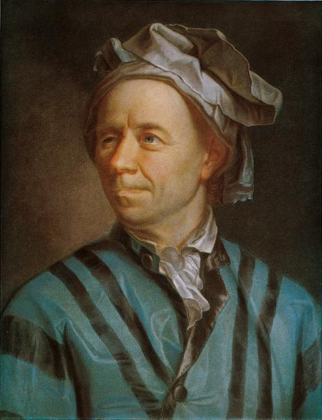

# 欧拉

在读莫里斯·克莱因的《古今数学思想》，终于读到欧拉（Leonhard Euler ，
1707年4月15日～1783年9月18日）。



欧拉恒等式：

\\[
e^{i\pi} + 1 = 0
\\]

克莱因写到：

> 他的某些书和400篇研究论文是他已完全失明后写的。他的著作集的现代版如
> 果完全出齐将会有74卷。

而且这么大的活动量并没有让他牺牲其他兴趣。他如常步入婚姻殿堂并是13个孩
子的父亲。他非常顾家，尽其所能地为家庭谋福利。他分时间在儿子孙子的教育
上，领着他们做科学游戏，念圣经给他们的心灵，“和他们一起消磨黄昏”。他
对化学、地质学、制图学也有兴趣，他还画了一张俄国地图。他还写了两本造船
的书，孜孜不倦地与伏尔泰争论哲学。

```
是谁来自
江河湖海
却囿于昼夜
厨房与爱
```

姬庚我说，想想欧拉，就别给自己的平凡找借口啦。

