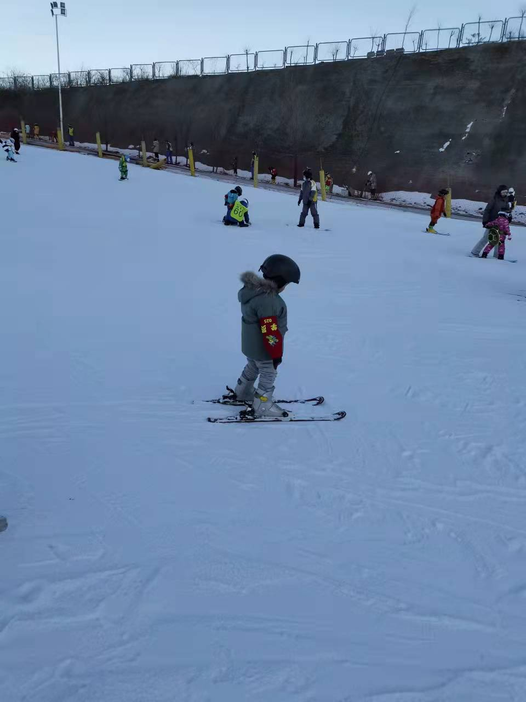

<code>❄️⛷️⛷️⛷️🎿️❄️2021年12月26日 星期日 晚 晴</code>

## 滑雪

今天下午带孩子们去西山滑雪。

## 哥哥

不知为啥，哥哥特别想去滑。西山滑雪场一开，就打算和他去。但我月末加班，
周六没时间了。周日上午十一点要打鼓，晚上六点要去接阿姨，正盘算时间是否
来得及呢，哥哥已经哭了，以为不陪他去。四年级小学生，在那傻哭，搞得我也
没啥可想的了。

## 妈妈

疫情前带他们滑的雪。那时哥哥和我有一两次学会了，妈妈带弟弟在雪场边上雪
上乐园玩。哥哥学会后，换妈妈看着滑，我带弟弟玩雪上轮胎啥的。集合的时候
发现妈妈一点都没滑，白白浪费钱。从此之后就不带妈妈来雪场，把老大一个人
放在雪场滑，我带老二雪上游乐园。

## 弟弟

这次妈妈依然不想去，我其实也不想带。问弟弟去不去？弟弟知道我要带他滑雪，
就说不去，讲了好几个理由，什么冷啦，也没什么好吃的呀，还不如和妈妈一起
去室内游乐场啦之类。但我看出来他就是害怕，别的都是托辞。妈妈也承诺可以
带他去商场游乐园玩。

我和哥哥十二点多要出发的时候，最后又问了他一次。他改主意，说好吧。我又
强调了一遍是去滑雪，他说好吧。于是我们就换厚衣服出发了。

## 教练

进到雪场之后才发现自己并没有带孩子滑雪的能力。我自己能滑，但我不会倒着
滑。就算正着滑，稍有分心就会摔跤。赶巧有一雪场工作人员，说也可以做教练，
就请了她一小时。我看了会他们在教学区练习基本动作，觉得无聊，就去初级道
找哥哥去了。

## 初道

西山滑雪场高道没开，只开了初道和中道，都要站很长时间的魔毯才能上去。风
倒是不大，到底西山滑雪场是坐落在山谷里。初道，中道，高道只是陡峭程度不
同的山坡，铺了人造的雪吧。我在初级道没找到哥哥，就兀自滑下来了。我真正
掌握了滑雪的一个技能——刹车，这使我平安滑到谷底。

## 练习

下来后发现哥哥在练习道。练习道和教学道一网之隔，而且在谷底是连通的。原
来他是想看看弟弟怎么样。我们仔细在教学道搜寻，没找到他们踪迹。他们也许
在魔毯上。弟弟穿的浅绿色外套，在雪地上看不分明。在我们要放弃寻找，站魔
毯上去的时候，忽然看到他们从雪坡上慢慢滑下来了。弟弟雪板掉了，教练帮弟
弟蹬上雪板。我们一起上去后，教练说，时间到了，就把弟弟还给了我。

## 中道

我们要从雪坡上滑到谷底。我仍然没有雪上看护技能。就把雪板蹬掉，只穿雪鞋，
打算扶着老二下去。老二摔手不让扶，还很恼怒的样子。我眼见他从高处，飞快
地滑下去。显然这一小时，教练没有教会他刹车技能。于是很自然地，弟弟慢慢
摔倒在距离谷底三分之一的雪坡上。褪掉雪板的能力也没有得到，只能坐在那里
了。 我蹬上雪板，慢慢滑过去，用我的刹车技能到他身边，帮他蹬开雪板，扶
他起来。他看起来开心，只是有点累。他说爸爸，我们回家吧。

哥哥不同意回家。他只滑了几次初级道，还没有滑中级道。我和弟弟站在底下看
哥哥随魔毯上去。太阳到山另一边去，雪地上浮着山的蓝影。哥哥消失在我们视
线之外。弟弟说待会他要吃点东西，我说好，但要等哥哥回来一起去。哥哥穿了
件红色外套，容易辨认。但天暗下来的缘故，几次都没有看对。最后一次认对了。
他滑的不快，刹车的技能是在的。问他今天摔了几次？说两三次，还有一次是被
别人撞到，那人也摔倒，绊到一起了。

## 追尾

还了雪具后去吃东西。老大要了个汉堡，老二要了个风车棒棒糖，还有一个巧克
力。路上让哥哥看弟弟有没有睡着，哥哥说不，因为不想动。没一会他们都睡着
了。我按高德地图开车，红绿灯前车急刹，我急刹但来不及。追了尾。前车司机
下来看了看，要说我几句没张嘴。我把车倒回来点。哥哥醒了，说你撞车了？我
说是的。弟弟还在睡。前车司机看了几眼，返回车走了。我都没下车。六点钟要
出发去接阿姨，这都五点四十多了。

