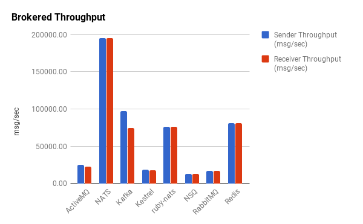

<div style="text-align: right"><code>2022年01月15日 星期六 上午</code></div>

## 00

[NATS]是[Neural Automatic Transport System]的缩写，翻译成中文是
[神经自动传输系统]。

## 01

> 本节译自[Publish Subscribe]。

NATS实现了一个分布式、一对多的、消息发布订阅通讯模型。发布者Publisher）
发送一个消息到一个主题（Subject），任何监听在这个主题的活跃的订阅者
（Subscriber）收到这个消息。订阅者也可以关注通配符匹配的主题，这有一点
点像正则表达式的意思。如下图示：

```artist
                                                  +----------+
                                     +-----msg1-->|Subscriber|
                                     |            +----------+
                                     |
                                     |
+---------+              +-------+   |            +----------+
|Publisher+-----msg1---->|Subject+---+-----msg1-->|Subscriber|
+---------+              +-------+   |            +----------+
                                     |
                                     |
                                     |            +----------+
                                     +-----msg1-->|Subscriber|
                                                  +----------+

```

这种一对多的模式有时候也叫扇出（Fan-Out）。

## 02

> 以下译自[https://derekcollison.net](https://derekcollison.net):
>
> Connect Everything
>
> 连接所有

> 以下译自[About Synadia](https://synadia.com/#about):
>
> 在Synadia，我们相信有一个机会，创建第一个去中心化的，安全的全球公共
> 服务，并由NATS.io所加持，来连接所有数字系统，服务和设备。

## 03

上节大略勾画NATS志向，要：

> 连接所有

何谓所有（Everything）？
1. 所有数字系统，
2. 所有服务，
3. 所有设备。

所有的数字系统是指：
1. IaaS云，包括中心云和边缘云，
2. PaaS云，比如一个K8S集群，或者一个LXD集群，包括中心的和边缘的，
3. 操作系统，包括虚机，物理机，系统容器，
4. 一组服务的集合。

所有服务是指：
1. 云原生服务，
2. 非云原生传统服务，
3. 运行在物理机上的服务，运行在虚机上的服务，运行在容器里的服务，
4. 跑在嵌入式设备里的服务，
5. 有状态服务，无状态可以扩容的服务，
6. http服务，grpc服务，tcp服务，udp服务。

所有设备：
1. 手机，
2. 嵌入设备，
3. PC，
4. 虚机，物理机，等。

### 本节大纲

本节翻译，缩写自[In Depth JWT Guide](https://docs.nats.io/using-nats/developer/tutorials/jwt)。

> 什么是Account？ Account是NATS的隔离上下文。

这个简明的论断无疑是正确的，也可能是准确的，但是不容易理解的。我们按这
个思路来理解，可能会好一些。首先问，NATS的资源是什么？显然是Subject，
因为NATS的一切围绕Subject展开。那Account就是NATS里Subject的名字空间
（Namespace）。假设有两个Account，A和B。在A和B里，可以各自有一套
Subject，即使彼此重名，也可以并行通信无误。如下，Account A和Account B，
在Account A里，有Subject a和Subject b，在Account B里，有Subject c和
Subject d：

```
.
├── A
│   ├── a
│   └── b
└── B
    ├── c
    └── d
```

账户A里的用户只能访问到Subject a和Subject b，账户B里的用户只能访问到
Subject c和Subject d。那这就是隔离。那如果B账户里的用户希望访问到A账户
里Subject怎么办呢？那就需要A账户把Subject Export出来，这样B账户可以
Import进来使用。比如：

```
accounts: {
    A: {
        exports: [
            {stream: a},
            {service: b},
        ]
    }
}
```

如上， Account A把自己的Subject a以stream的形式暴露出来，把Subject b以
service形式暴露出来。 这样Account B可以Import：

```
accounts: {
    B: {
        imports: [
            {stream: {account: A, subject: a}},
            {service: {account: A, subject: b}},
        ]
    }
}
```

因为在Account B里没有名为a和b的Subject，因此可以直接以Subject的原名引
入。 对以Stream形式引入的Subject a，Account B里用户只可以订阅。对以
Service形式引入的Subject b，Account B里的用户既可以订阅，也可以发布，
还可以执行请求回复操作，简直和用自己Account里的Subject一样。


## 04

<!-- NATS部署 -->

## 05

<!--  -->
译自[Virtualization and containerization considerations]。

> 嗯你当然可以用容器编排系统，诸如Kubernetes，Nomad或Docker Swarm来部
> 署你的NATS服务器基础设施，的确也有非常多的人如是做，我们的推荐是，对
> NATS服务基础设施只是：基础设施。意思是它最好运行在和你的容器同等的基
> 础设施上，而不是在容器里。
>
> 因为每一层的虚拟化，容器化和重导向[^1]都可能是问题之源，都可能导致延
> 迟，并且容器编排系统在那去提供服务（例如，检测进程是一直在运行还是没
> 有，重导向相应网络流量以提供高可用的形式），这些已经更好，更快地实现
> 在了NATS自己里。
> 
> 问自己这个问题，如果你想得到最优性能，最大可靠性，最快速的容错倒换，
> 你会在容器里运行你的数据库服务吗，并且用Kubernetes/Nomad/Swarm编排？
> 还是直接在虚拟机里，在尽可能接近裸机的环境里运行他们？
>
> NATS服务器是高效地‘消息路由器’。他们持续从网络得到数据，通过网络发
> 送数据。如果JetStream启用的话还会持续读写文件。他们高度优化有很多，
> 诸如内置心跳，故障转移和流控机制。在NATS服务器进程，网络和磁盘之间的
> 层级数越小，它就工作的越快，并且这些多出的层级还有可能破坏或者放置比
> 如一些配置错误。并且你并不依赖代理呀，端口映射呀或者DNS一些伎俩，只
> 是为了让你的客户端应用能连上NATS服务器实例，因为你的容器编排系统把他
> 们挪到一边去了，如果运行在虚机里，他们只需简单地重启，客户端继续用相
> 同已知IP地址或者别名。

[^1]: `iptables -t nat -A PREROUTING -p tcp -j REDIRECT ...`

## 05

译自[Dissecting Message Queues]：

> 现在我们看看代理消息队列。
>
> 
>
> 咋一看，代理消息队列比无代理消息队列吞吐量引人注目地减少，大部分降好
> 几个数量级。半数代理消息队列的吞吐量在25,000消息/秒以下。Redis数字也
> 许有点误导。尽管提供了发布订阅的功能，Redis也不是真为一个鲁棒的消息
> 队列而设计。与ZeroMQ类似风格，Redis断连慢客户端，重要的是，它也不能
> 可靠处理这类消息。因此，我们踢它出局。Kafka和ruby-nats性能与Redis类
> 似，但在没有间歇失败情况下可以可靠处理消息。NATS的Go实现，gnatsd[^2]，
> 作为一个代理消息队列，吞吐量表现杰出。
>
> 不考虑特殊情况，我们看到代理消息队列吞吐量相当一致。不像无代理库，发
> 送和接受有少到几乎没有的不一致，基本都差不多。

[^2]: 如今叫回了NATS。

[NATS.io]: https://docs.nats.io
[NATS]: https://nats.io
[Neural Automatic Transport System]: https://docs.nats.io/reference/faq#what-does-the-nats-acronym-stand-for
[神经自动传输系统]: https://docs.nats.io/reference/faq#what-is-nats
[Virtualization and containerization considerations]: https://docs.nats.io/nats-concepts/service_infrastructure#virtualization-and-containerization-considerations
[Dissecting Message Queues]: https://bravenewgeek.com/dissecting-message-queues/
[从开发者的角度比较Kubernetes和Cloud Foundry]:http://dockone.io/article/5679
[Comparing Kubernetes to Pivotal Cloud Foundry A Developer's Perspective]: https://medium.com/@odedia/comparing-kubernetes-to-pivotal-cloud-foundry-a-developers-perspective-6d40a911f257
[Publish Subscribe]: https://docs.nats.io/nats-concepts/core-nats/pubsub
