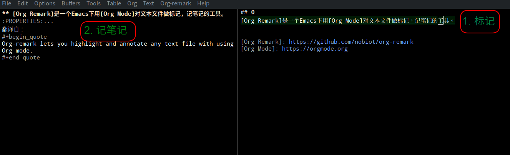

## 0
[Org Remark]是一个Emacs下用[Org Mode]对文本文件做标记记笔记的工具。



[Org Remark]: https://github.com/nobiot/org-remark
[Org Mode]: https://orgmode.org

## 1

这有什么用呢？

我在精读代码的时候用它来记笔记。就像读书一样，有时不解，就先把疑惑记下
来。有时懂了，就把一点心得记下来。这笔记和读纸质书，写在书边上笔记一样。

1621年费马读丢番图的《算术》，读到：

$$
a^2 + b^2 = c^2
$$

有无数组整数解存在，由此想到费马猜想：$$a^n + b^n = c^n$$

当$$n > 2$$时， 整数解不存在。 于是他在纸边写下：

> 我想到了一个绝妙的证明，但是这里太窄了，写不下。

[Org Remark]给的纸边不窄，[Org Mode]数学公式支持也很好，费马再无借口，
费马定理或能提前370多年得证。

## 2

[Org Remark]安装配置简单。

1. 安装
   ```
   M-x package-install org-remark
   ```
2. 配置
   ```
   M-x customize-variable org-remark-global-tracking-mode t
   M-x customize-variable org-remark-notes-file-name ~/.emacs.d/marginalia.org
   ```
3. 快捷键
   ```
   (define-key global-map (kbd "C-c n m") #'org-remark-mark)
   (with-eval-after-load 'org-remark
     (define-key org-remark-mode-map (kbd "C-c n o") #'org-remark-open)
     (define-key org-remark-mode-map (kbd "C-c n [") #'org-remark-prev)
     (define-key org-remark-mode-map (kbd "C-c n ]") #'org-remark-next)
     (define-key org-remark-mode-map (kbd "C-c n r") #'org-remark-remove))
   ```

笔记文件名我选的绝对路径，也就是说所有笔记都记在一个文件
（`~/.emacs.d/marginalia.org`）。如选相对路径，比如`marginalia.org`，
那每个目录都会生成一个`marginalia.org`文件。阅读源码时候一般都有版本控
制Git在，多一个文件稍有不便。

## 3

和读书笔记工具一样，[Org Remark]有两个使用模式：
1. 记笔记，
2. 读笔记。

| 功能 | 命令                    | 快捷键    |
|------|-------------------------|-----------|
| 标记 | `M-x org-remark-mark`   | `C-c n m` |
| 开记 | `M-x org-remark-open`   | `C-c n o` |
| 上条 | `M-x org-remark-prev`   | `C-c n [` |
| 下条 | `M-x org-remark-next`   | `C-c n ]` |
| 删除 | `M-x org-remark-remove` | `C-c n r` |

在阅读的时候随手标注：
```
    M-x org-remark-mark
```
记下所思所想：
```
    M-x org-remark-open
```
再次阅读的时候看到自己的标记，打开：
```
    M-x org-remark-open
```
翻到上一个标记：
```
    M-x org-remark-prev
```
下一个标记：
```
    M-x org-remark-next
```

如果看到有些不实（比如费马看到自己的标注），可以删掉：

```
    M-x org-remark-remove
```
## 4

这些笔记是用文本格式的[Org Mode]所写，一些有价值的东西将来方便整理出来，
就如本篇文档一样。


