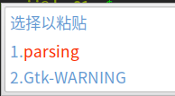
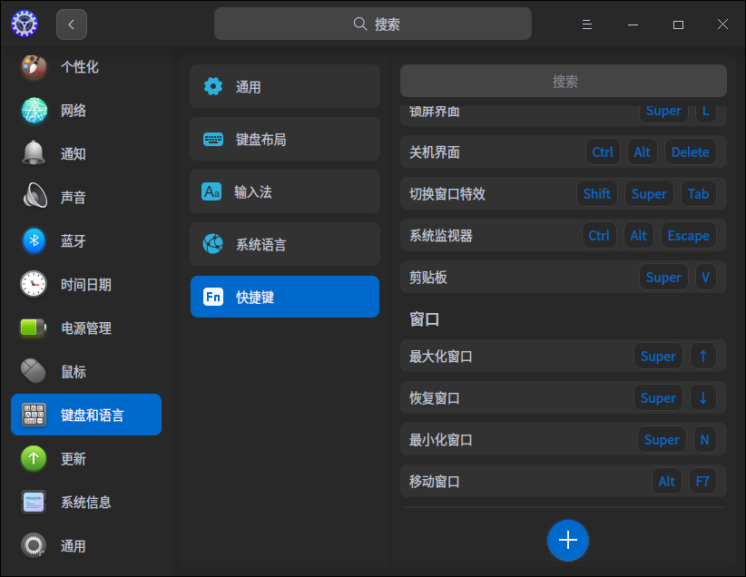
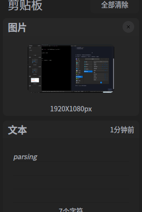
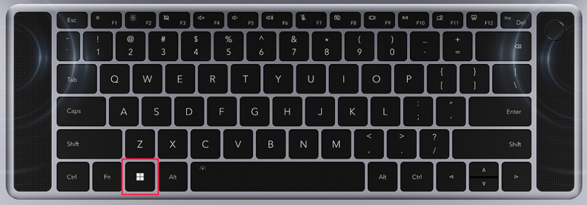
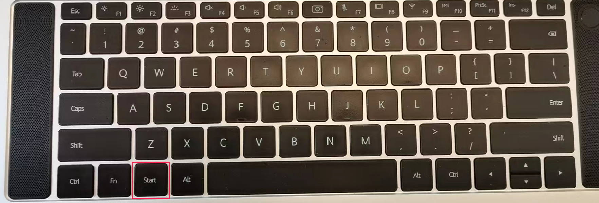
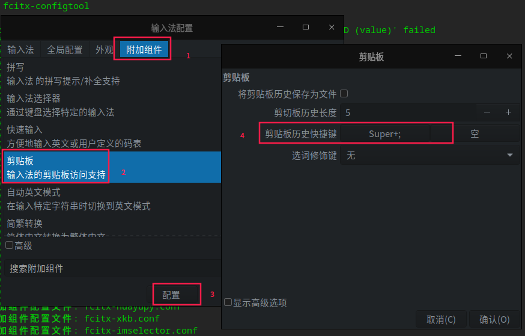

<div style="text-align: right"><code>2022年05月15日 星期日 下午</code></div>

## 0

Emacs下`iedit-mode`定义了一个快捷键：`Ctrl-;`。但这个快捷键在Deepin Linux下被占用了：



由于我大部分时间泡在Emacs里，不大许什么东西能挡了Emacs的道儿。因此我需要：
1. 找出谁设置了`Ctrl-;`,
2. 禁掉或修改为其他。

## 1

Linux桌面并没有一个管理所有全局快捷键的地方。Deepin提供了一个快捷键管
理的入口，控制中心 -> 键盘和语言 -> 快捷键：



其中有一个绑定在剪贴板的快捷键`Super-V`：



`Super`其实就是Windows下的Windows键：


荣耀出Linux本，键盘改了点：


Deepin沿用`Super-V`也是为了和`Windows`下的使用习惯保持一致。这也不是必
要的。Windows下的快捷键管理也混乱，没有统一的地方；快捷键还满天飞。看
似为了用户的方便，太多的快捷键反而给用户（尤其是Emacs用户）造成麻烦。
微软的开发好像也没有意识到这一点。我们可以从微软新近应用`vscode`和
`terminal`快捷键的设置印证这一点。

回到主题，这个`Ctrl-;`并不是Deepin设置的。

## 2

我用`xwininfo`看这个粘贴板窗口，得到：

```
xwininfo: Window id: 0x600002 "Fcitx Input Window"

  Absolute upper-left X:  1
  Absolute upper-left Y:  839
  Relative upper-left X:  1
  Relative upper-left Y:  839
  Width: 200
  Height: 162
  Depth: 24
  Visual: 0x21
  Visual Class: TrueColor
  Border width: 0
  Class: InputOutput
  Colormap: 0x20 (installed)
  Bit Gravity State: NorthWestGravity
  Window Gravity State: NorthWestGravity
  Backing Store State: WhenMapped
  Save Under State: yes
  Map State: IsViewable
  Override Redirect State: yes
  Corners:  +1+839  -1719+839  -1719-79  +1-79
  -geometry 200x162+1-79
```
可以看到，是`fcitx`输入法框架(Free Chinese Input Toy for X，小企鹅输入法框架)设置的。

## 3

我在Linux下用的是华宇拼音输入法：


华宇拼音输入法的前身是紫光拼音输入法。在Linux下，其也是基于`fcitx`输入法框架实现。这没啥特别，其他如：
1. 搜狗拼音，
2. Sun拼音，

等，也是基于`fcitx`输入法框架实现。`fcitx`大有一统江湖之势。

## 4

剪贴板是放到Deepin设置里管理，还是放到输入法框架里管理呢？这是个问题。
我现在看到`dde-clipboard`可以管理的内容有文本和图片。`fcitx`的剪贴板管
理只有文本。 `fcitx`剪贴板更容易使用，和输入文字一样，使用数字选取剪贴
板历史。

## 5

最终我使用`fcitx-configtool`将剪贴板历史快捷键修改为`Super-;`：



## 6

Linux桌面下全局快捷键需要一个统一管理的地方。如今的管理太分散。全局快
捷键的定义也应该越少越好，最好能够提供统一的去除方法，把不使用的权利还
给用户。
