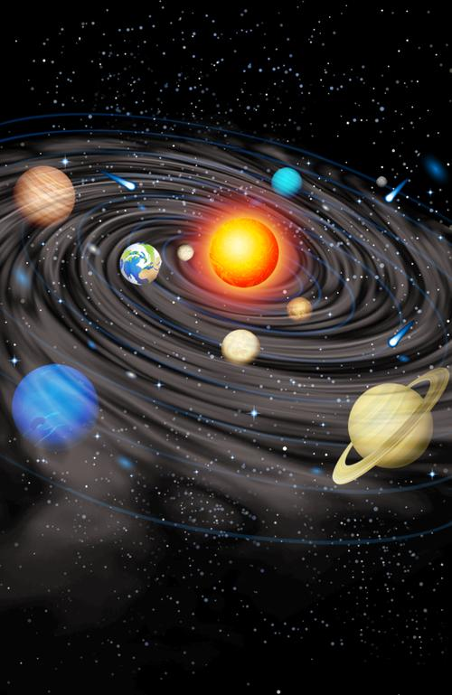

## 0

## 1

太阳质量占太阳系质量的99.86%，相当于30万个地球质量。万有引力使得太阳只
能居于中心，独自燃烧直至成为：
1. 黑洞，
2. 红巨星，
3. 白矮星。

太阳的命运大抵如此。这也是恒星的命运。

## 2

八大行星由里至外：水星，金星，地球，火星，木星，土星，天王星，海王星。

冥王星除名行星列为矮行星。成为行星的三个条件：
1. 围绕恒星太阳运行，
2. 拥有足够质量形成近似球形，
3. 清空其轨道上其他天体。

冥王星太小，质量仅为月球的1/6，地球的1/486。这么小天体其周围还有五颗卫
星：卡戎、尼克斯、许德拉、科波若斯和斯提克斯。其中卡戎又太大，质量有冥
王星的1/8，不能成为冥王星真正的卫星，与冥王星形成双星，相互围绕着旋转。
因此冥王星违反了行星准入标准第2条。

冥王星的轨道偏心率太大，轨道不规整，与八大行星不在一个平面。冥王星轨道
与海王星轨道重合一部分，冥王星也没能力把海王星收了。因此违反了行星准入
第3条。

总之，小是原罪，说别的都没用。

## 3

海王星质量是地球的17倍，体积是地球的58倍。冥王星轨道部分与海王星轨道重
合。以冥王星的体量，海王星收了冥王星当卫星也没有什么不可以。但冥王星串
门的时机掌握得好，每次都能全身退出来，所谓轨道共振。

海王星有14颗卫星，其中最大的海卫一质量是冥王星的1.6倍。

## 4

天王星质量是地球的15倍，有27颗卫星，都不大。其中最大的天卫三相当于月球
质量1/22。

## 5

土星是伽利略发现的，质量是地球的95倍。卫星众多，还没有精确数目。最大卫
星土卫六，又名泰坦星，质量是月球1.8倍。

## 6

木星质量是地球的318倍，卫星众多。其中最大的木卫三质量是月球的2倍，是太
阳系最大卫星。

## 7

火星是地球质量1/9。有两颗卫星，都很小。其中火卫二是太阳系最小的卫星。
总之火星很小，但也足以把系统内部治理整齐，轨道规则，符合行星准入规则。

## 8

地球只有一个卫星：月球。月球质量大到水星的2/9。作为地球的伴侣，并没有
扰乱地球作为行星的资格。

## 9

金星质量是地球的4/5。尼斯，曾被认为是金星的卫星。人类仔细观察后发现，
尼斯只是碰巧出现在金星天域的昏暗恒星罢了。因此现在金星没有卫星。

## 10

水星质量是地球的1/17，月球质量的4.5倍，最小，但也是冥王星的28倍。和金
星一样，水星也没有卫星，两个原因：
1. 离太阳太近，
2. 质量太小。

这都是二行星无法选择的，由此决定二行星注定行星的命运。

