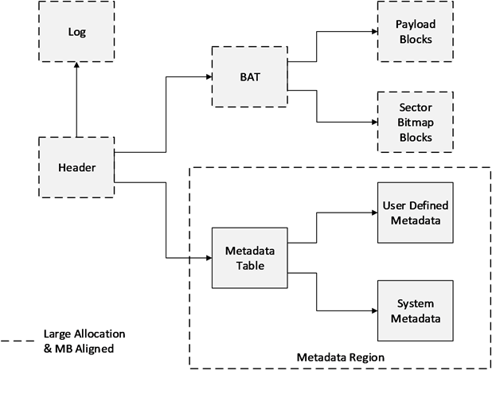
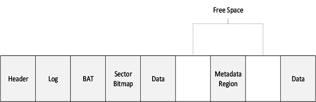
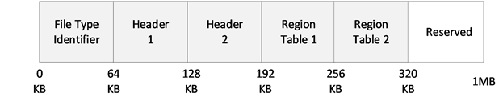

## 0
VHDX微软有一个三四十页的规范。VHDX的特性：
1. 固定大小虚拟磁盘，
2. 动态大小虚拟磁盘，
3. 差分盘。





## 1

迟子建的《额尔古纳河右岸》我有些读不进去。


## 2

> 我是雨和雪的老熟人了，我有九十岁了。雨雪看老了我，我也把它们给看老了。

还没怎么写就四个“了”。我很难把一场一场的雨雪和老熟人联系起来，我看不
到雨雪的皱纹，白发，到底长在哪里。我也想象不出雨雪变老的样子。

## 3

相较于物理磁盘，差分盘算个新概念，这里稍微展开解释一下。

创建VHDX：
```
DISKPART> create vdisk file=E:\disk00.vhdx type=expandable maximum=30000
```

创建了一个大小为30G的虚拟磁盘，由于类型是expandable的，文件disk00.vhdx
大小为3M。

做下分区（按UEFI启动的操作系统来分区）：
```
DISKPART> select vdisk file=E:\disk00.vhdx
DISKPART> attach vdisk
DISKPART> gpt
DISKPART> create partition efi size=512
DISKPART> format fs=fat
DISKPART> create partition primary
DISKPART> format fs=ntfs quick
```

以disk00.vhdx为母盘，创建一个差分盘disk01.vhdx:
```
DISKPART> create vdisk file=E:\disk01.vhdx parent=E:\disk00.vhdx
```

把差分盘挂上，其分区和母盘一样：
```
DISKPART> select vdisk file=E:\vdisk01.vhdx
DISKPART> attach
DISKPART> list partition
```

把其分区挂为卷：
```
DISKPART> select partition 1
DISKPART> assign letter=S
DISKPART> select partition 2
DISKPART> assign letter=M
```

两个盘符（S：，M：）出现，可以进行文件读写。读写产生的文件会留在差分盘。
差分盘的大小也基本就是与母盘不同的差分文件的大小。

一个母盘可以有多个差分盘，而差分盘内容可以各不相同。一个差分盘还可以继
续有差分盘，只要指定其为母盘。母盘与其差分盘之间就是树的结构了。因此业
有深度的概念。

差分盘内容可以回写到母盘：
```
DISKPART> select vdisk file=E:\vdisk01.vhdx
DISKPART> detach vdisk
DISKPART> merge vdisk depth=1
```
指定的深度为1。差分盘内容回写到母盘后，差分盘就基本是空的了。

## 4

> 那时额尔古纳河右岸的森林，不仅有遮天蔽日的大树，而且河流遍布。所以很
> 多小河是没有名字的。如今这些小河就像划过天际的流行一样，大部分已经消
> 失。那么就让我在追忆它们的时候，把那条无名的小河，叫堪达罕河吧，因为
> 我第一次见到堪达罕，就是在这条河流上。

我隐隐感觉这里的逻辑，如果有的话，不一致，不严谨，感性而虚伪。遮天蔽日
的森林河流遍布，堪达罕可以踏入很多条河流。就是它的粪便，也可能这条小河
边落一些，那条小河边有一些。它毕竟是个活泼的动物，要到处跑的嘛。怎么说
呢？就像鲁迅讲述闰土猎猹一样，怎不把海边无名沙地叫猹地呢？

## 5

母盘与其差分盘之间是树的结构。那树就有宽度和高度。先说宽度。比如：

```
vdisk00 -- vdisk01
       `-- vdisk02
```

vdisk01 和 vdisk02 拥有共同母盘 vdisk00 。都不回写相安无事，vdisk01 一
旦回写，vdisk02 就废了，差分不上母盘了。

最优的选择似乎是不回写。

微软的虚拟化底座 HyperV，把虚拟机起在拥有共同母盘的子盘上。可以：
1. 节省些存储，据说可以节省90％存储，
2. 发放速度也有提高，因为不用重复拷贝母盘。

## 6

> 妮浩说，金得很善良，他虽然想吊死，但不想害了一棵生机勃勃的树，所以才
> 选择了一棵枯树。

那就得说说什么叫善良了。宁死不害死一棵树，却以死毁了自己的新娘一生，离
珍爱自己的父亲而去，留自己好强而内心阴暗的母亲抱恨一世。不知这算不算愚
昧呢？

## 7

FSLogix 做用户配置管理的时候，也用到这一点。但多会话回写母盘就拎不
清了。想了很多办法，都不理想。

| ProfileType | 会话 | 母盘 | 远程差分盘 | 本地差分盘 |
|-------------|------|------|------------|------------|
| 0           | 1    | 挂载 | -          | -          |
|             | 2    | -    | -          | -          |
| 1           | 1    | 母盘 | 挂载       | -          |
|             | 2    | -    | -          | -          |
| 2           | 1    | 母盘 | -          | 挂载       |
|             | 2    | 母盘 | -          | 挂载       |
| 3           | 1    | 母盘 | 挂载       | -          |
|             | 2    | 母盘 | -          | 挂载       |

## 8

> 魂灵去了远方的人啊，
>
> 你不要惧怕黑夜，
>
> 这里有一团火光，
>
> 为你的行程照亮。

我不太明白**这里**的火光怎么能照亮**远方**黑夜里人的行程。毕竟火光不是
激光。激光也不是为了照明的。 欣赏不了建立在混乱逻辑上精致的美感。

## 9

微软的操作系统，比如Windows 10，可以直接从VHDX虚拟磁盘启动，当然也可以
从差分盘启动。此时：
1. 母盘需要和差分盘在一个卷上，
2. 母盘或差分盘不能在远程，
3. 母盘不能是动态的，而只能是静态的。

这一系列的限制把思杰逼到了PVS的道路上。

iSCSI可以把VHDX虚拟磁盘暴露为一个LU（Logical Unit），从操作系统来看就
是一个磁盘。使用类似iPXE的Boot Loader可以把虚拟磁盘远程加载，这是无盘
工作站的模型。微软有一个Windows iSCSI Target Server，鼓励人结合VHDX差
分盘，结合iPXE远程启动，鼓捣无盘工作站。国内很多网吧这么搞。但远程磁盘
毕竟性能不好。

微软在VHDX规范提到似乎存在一个iSCSI Parent Locator，可以把iSCSI LU当作
本地差分盘的母盘来用。再考虑微软Mini Filter驱动，冥冥之中，似乎有一个
比思杰PVS更优的Diskless方案存在，但还不知道具体在哪里。

## 10

回到差分盘。不妨把问题更清晰的表述一下。vdisk00同为 差分盘vdisk01和差
分盘vdisk02的母盘：

```
vdisk00 -- vdisk01
   | 
   `------ vdisk02
```

如果差分盘vdisk01回写母盘vdisk00，那差分盘vdisk02的母盘vdisk00就变化了。
差分盘vdisk02就是一个无效虚拟磁盘了：无效磁盘无法挂载。

## 11



VHDX是双头的，不仅为了冗余。

